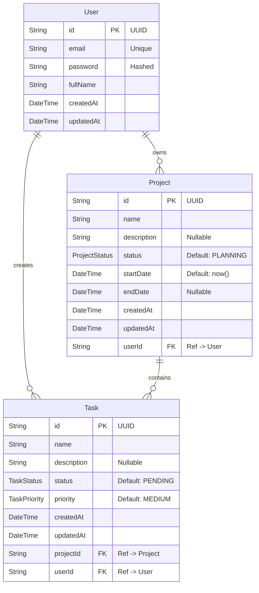

# Database Schema (ER Diagram)

The application utilizes a PostgreSQL database. Below is the simplified Entity-Relationship representation.

## ER Diagram

## Enums
- **ProjectStatus**: `PLANNING`, `IN_PROGRESS`, `COMPLETED`, `ON_HOLD`
- **TaskStatus**: `PENDING`, `IN_PROGRESS`, `COMPLETED`
- **TaskPriority**: `LOW`, `MEDIUM`, `HIGH`

## Security Notes
- The `userId` on the `Task` model is derived server-side from the authenticated user during creation and is validated against the `Project`'s owner. Frontend attempts to forge ownership are blocked.
