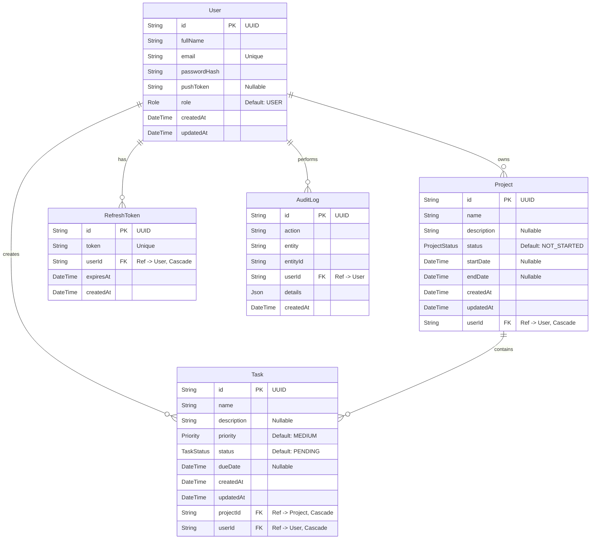

# Database Schema (ER Diagram)

The application utilizes a PostgreSQL database managed via Prisma ORM. Below is the Entity-Relationship representation of the final codebase.

## ER Diagram

## Enums
- **Role**: `USER`, `ADMIN`
- **ProjectStatus**: `NOT_STARTED`, `IN_PROGRESS`, `COMPLETED`
- **TaskStatus**: `PENDING`, `IN_PROGRESS`, `COMPLETED`
- **Priority**: `LOW`, `MEDIUM`, `HIGH`

## Ownership Relationships
- The `userId` on the `Project` and `Task` models is derived server-side from the authenticated user during creation and is validated against the `Project`'s owner. Users can never view, edit, or delete another user's projects or tasks.
- Cascade deletion is enabled so deleting a `User` removes their `Project`s, `Task`s, and `RefreshToken`s, and deleting a `Project` removes its `Task`s.
